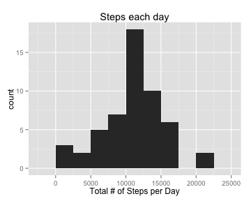
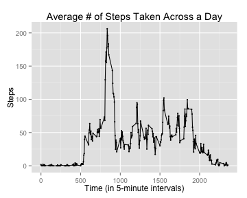
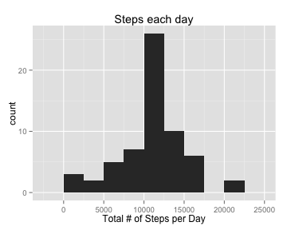
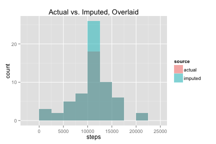

# Reproducible Research: Peer Assessment 1


```r
opts_chunk$set(echo=TRUE)
```

## Loading and preprocessing the data


```r
##
## 1) Load the data (i.e. read.csv())
## 2) Process/transform the data (if necessary) into 
##    a format suitable for your analysisgetw
##

setwd("/Users/JerryTsai/userjst/individ/knowledg/cur/jhu.sph/ds05_reproducible/projects/project01/RepData_PeerAssessment1")

library(plyr)

activityDF <- read.csv("activity.csv", header=TRUE)
# str(activityDF)
activityDF$Rdate <- as.Date(strptime(activityDF$date, "%Y-%m-%d"))
```

Note that unless otherwise stated, calculations will ignore missing values for the step count.


## What is mean total number of steps taken per day?

A histogram displayed below shows the distribution of the number of steps taken each day.


```r
##
## 1) Make a histogram of the total number of steps taken each day
##

activityDF_noNA <- activityDF[(which(!is.na(activityDF$steps))), ]

by_date <- ddply(activityDF_noNA, .(Rdate), summarize, steps=sum(steps, na.rm=TRUE))

## Alternative way of summing the steps by date,
## using a data.table, to check work, in case you 
## are interested
##
## library(data.table)
## activityDT <- as.data.table(activityDF)
## by_date <- tester[, sum(steps, na.rm=TRUE), by=date]
## setnames(by_date, c("date", "steps") )

library(ggplot2)
qplot(steps, data=by_date, geom="histogram", binwidth=2500, xlab="Total # of Steps per Day", 
      main="Steps each day")
```

 


```r
##
## 2) Calculate and report the mean and median 
##    total number of steps taken per day
##

## Because of the earlier removal of NAs, setting
## na.rm=TRUE will do nothing, but I'm leaving it in
median_steps_per_day <- median(by_date$steps, na.rm=TRUE)
mean_steps_per_day <- as.integer(round(mean(by_date$steps, na.rm=TRUE)))
```

The mean number of steps taken per day is 10,766, and the median number of steps taken per day is 10,765.  
  

## What is the average daily activity pattern?

A time series plot of the average number of steps taken in every 5-minute interval is displayed below:


```r
##
## 1) Make a time series plot (i.e. type = "l") of the 
##    5-minute interval (x-axis) and the average number of 
##    steps taken, averaged across all days (y-axis)
##

by_interval <- ddply(activityDF, .(interval), summarize, mean_steps=mean(steps, na.rm=TRUE))

ggplot(by_interval, aes(interval, mean_steps)) + 
    geom_point(size=1) + 
    geom_line() + 
    xlab("Time (in 5-minute intervals)") + 
    ylab("Steps") + 
    ggtitle("Average # of Steps Taken Across a Day")
```

 


```r
##
## 2) Which 5-minute interval, on average across all the 
##    days in the dataset, contains the maximum number of steps?
##
max_mean_steps_row <- by_interval[which.max(by_interval$mean_steps),]
```

The 5-minute interval in which the most steps were taken on average was 835, with an average of 206 steps taken during that interval.  


## Imputing missing values


```r
##
## 1) Calculate and report the total number of missing values 
##    in the dataset (i.e. the total number of rows with NAs)
##

number_of_NA <- sum(is.na(activityDF$steps))
```

Out of 17,568 rows, the missing values in the dataset number 2,304.

Missing values for the number of steps taken in a 5-minute interval will be imputed, using the mean of the non-missing values for number of steps taken in the same interval.


```r
##
## 2) Devise a strategy for filling in all of the missing values 
##    in the dataset
##

## Impute the missing values with mean number of steps for the same interval

## Select rows from the activity data set for which steps are missing, and
##   drop the steps variable to create activityNA data frame
activityNA <- activityDF[which(is.na(activityDF$steps)), !(names(activityDF) %in% c("steps"))]

## Merge the by_interval dataset, which contains the mean number of steps
##  for each interval, with the rows for which steps are missing, 
##  grafting this information by interval
graft_info <- merge(by_interval, activityNA, by=c("interval"))

## Rename "mean_steps"" variable as "steps""
names(graft_info)[names(graft_info)=="mean_steps"] <- "steps"

##
## 3) Create a new dataset that is equal to the original 
##    dataset but with the missing data filled in.
##

## Combine rows with imputed data with rows with actual data in one data frame
imputedDF <- join(graft_info, activityDF[which(!is.na(activityDF$steps)), ], type="full")
```

```
## Joining by: interval, steps, date, Rdate
```

```r
sortedDF <- imputedDF[order(imputedDF$Rdate, imputedDF$interval), ]

# Check to see if there are any missing values for step
# sum(is.na(imputedDF$steps))
# [1] 0
```

A histogram displayed below shows the distribution of the number of steps taken each day, using the imputed data.


```r
##
## 4) Make a histogram of the total number of steps taken 
##    each day and Calculate and report the mean and median 
##    total number of steps taken per day. Do these values 
##    differ from the estimates from the first part of the 
##    assignment? What is the impact of imputing missing data 
##    on the estimates of the total daily number of steps?

imputed_by_date <- ddply(imputedDF, .(Rdate), summarize, steps=sum(steps, na.rm=TRUE))

qplot(steps, data=imputed_by_date, geom="histogram", binwidth=2500, 
      xlab="Total # of Steps per Day", main="Steps each day")
```

 

```r
imputed_median_steps_per_day <- median(imputed_by_date$steps, na.rm=TRUE)
imputed_mean_steps_per_day <- as.integer(round(mean(imputed_by_date$steps, na.rm=TRUE)))
```

The mean number of steps taken per day, using imputed data, is 10,766, and the median number of steps taken per day, using imputed data, is 10,766. 
  
The mean and median, using the imputed data, of the total number of steps each day differs from the mean and median using only actual data. Imputation has not changed the mean. It was 10,766 and remains 10,766. The median barely increased, going from  10,765 to  10,766.  
  
After imputation, the distribution of the total number of steps taken each day became more peaked (i.e., leptokurtic). You can see this in the plot below, where the actual and imputed histograms have been overlaid. 


```r
combo_set <- rbind(cbind(by_date, source="actual"), 
                   cbind(imputed_by_date, source="imputed"))

ggplot(combo_set, aes(steps, fill=source)) + 
    geom_histogram(binwidth=2500, alpha=.5, position="identity") + 
    ggtitle("Actual vs. Imputed, Overlaid") 
```

 


## Are there differences in activity patterns between weekdays and weekends?


```r
#
# 1) Create a new factor variable in the dataset with two 
#    levels -- "weekday" and "weekend" indicating whether a 
#    given date is a weekday or weekend day.
#

weekdayDF <- transform(sortedDF, 
                       dayFlag = as.factor(ifelse(weekdays(sortedDF$Rdate) %in% 
                                 c("Saturday","Sunday"), "Weekend", "Weekday")) )

## Check work: validated
## head(weekdayDF)
## table(weekdayDF$Rdate, weekdayDF$dayFlag)
```

A comparison of weekday and weekend activity is displayed below:


```r
##
## 2) Make a panel plot containing a time series plot 
##    (i.e. type = "l") of the 5-minute interval (x-axis) and 
##    the average number of steps taken, averaged across all 
##    weekday days or weekend days (y-axis). 
##

by_dayFlag_interval <- ddply(weekdayDF, 
                             .(dayFlag, interval), 
                             summarize, 
                             mean_steps=mean(steps, na.rm=TRUE)
                             )

ggplot(by_dayFlag_interval, aes(interval, mean_steps)) + 
    geom_line() +
    facet_wrap( ~dayFlag, nrow=2) +
    xlab("Interval") +
    ylab("Number of steps")
```

 

Using the imputed data, on average the person is more active during weekends than weekdays, particularly after 10am.
